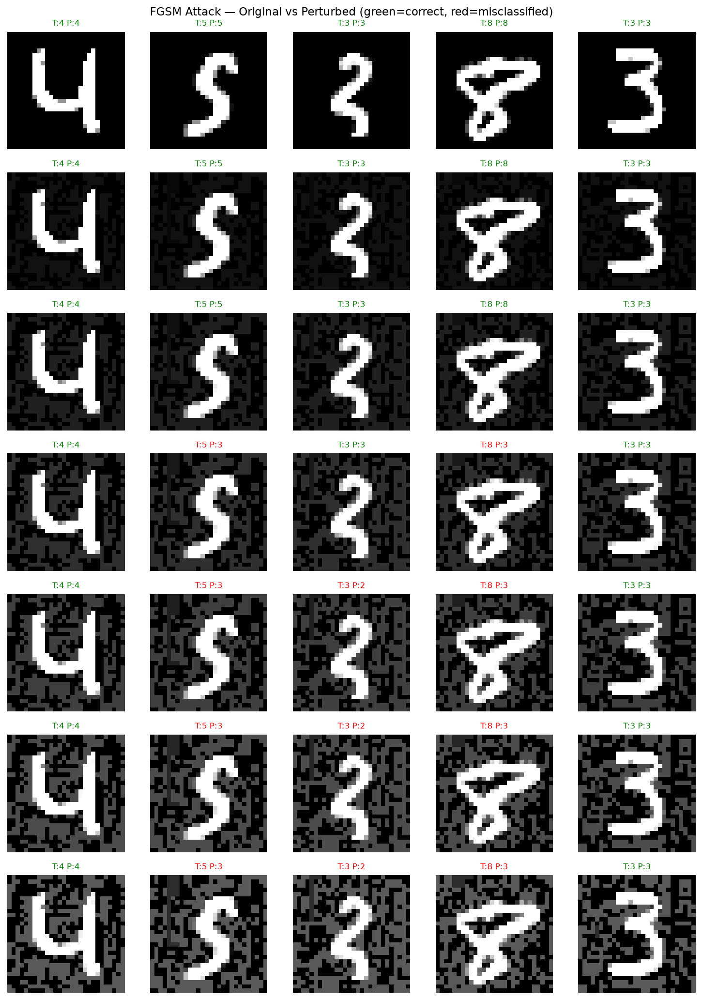
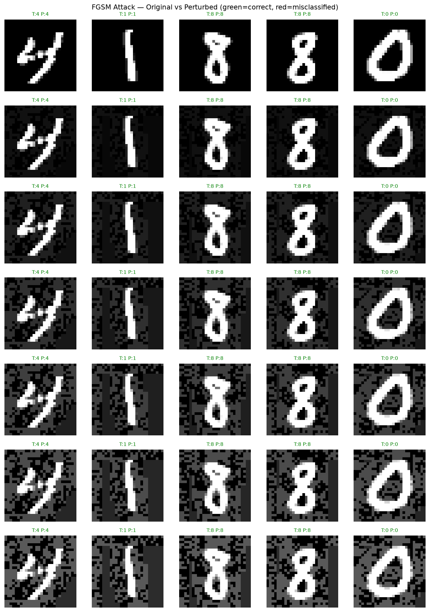

# Adversarial ML - MNIST

Exploring adversarial attacks and defenses on a CNN image classifier trained on MNIST.

## Goal
Train a CNN on MNIST, implement adversarial attacks (FGSM, eventually PGD and more), and evaluate defenses including adversarial training.

## Overview

## Structure
- `attacks/` - attack implementation
- `defenses/` - defense implementation
- `models/` - saved model weights
- `results/` - visualization, plots and metrics

## Results
### FGSM Attack on baseline CNN
### Adversarial training defense (trained at epsilon=0.20)

## Visualizations
### Baseline model undef FGSM attack


### Adversially trained model undef FGSM attack


## Setup
```bash
git clone https://github.com/EYK02/adversarial-ml.git
cd adversarial-ml
python -m venv venv
venv\Scripts\activate
pip install -r requirements.txt
```

## Reproducing results

Traning baseline model:
```bash
python train.py
```

Evaluate FGSM attack:
```bash
pythin -m attacks.evaluate_fgsm
```

Visualize attack:
```bash
python -m results.visualize_fgsm
```

Note: To change which model to visualize, one is required to edit the fields model_path and save_path to their relevant paths.

Train adversarial defense:
```bash
python -m defense.adversarial_training.
```

Evaluate adversarially trained model and compare to baseline model:
```bash
python -m defense.evaluate_defense
```
