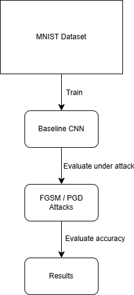
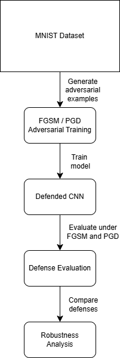
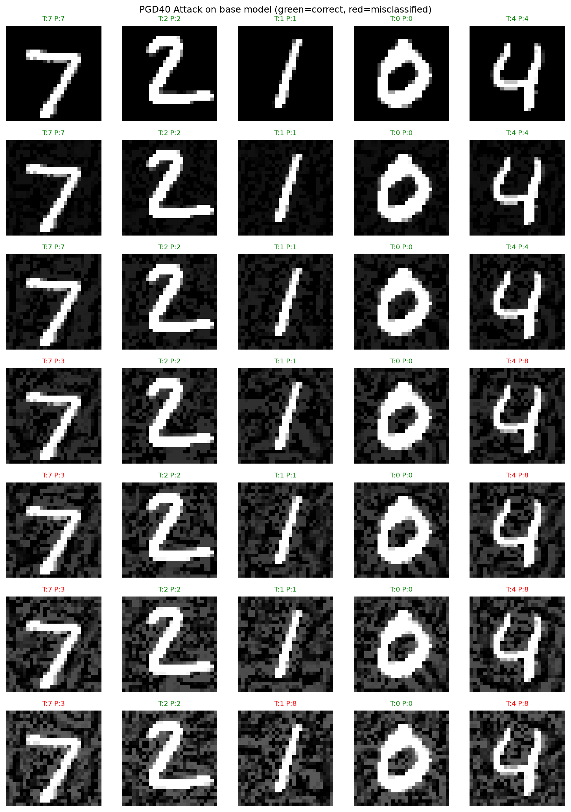
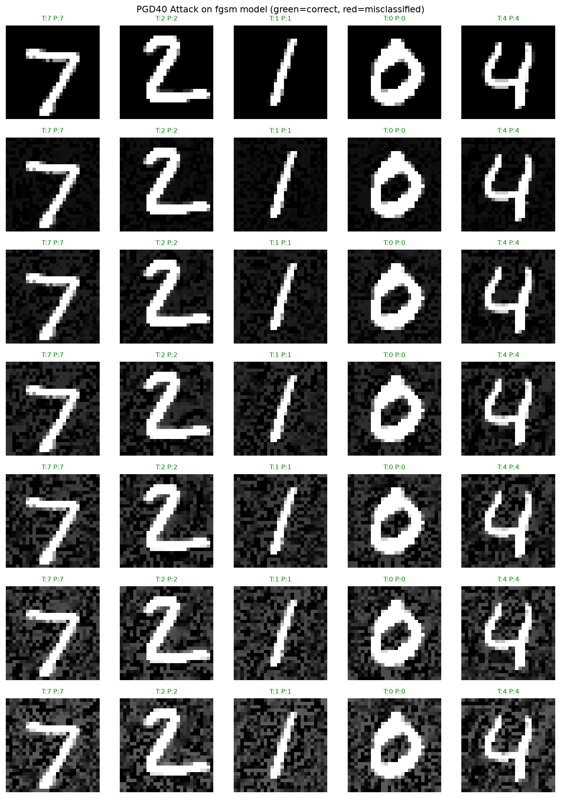
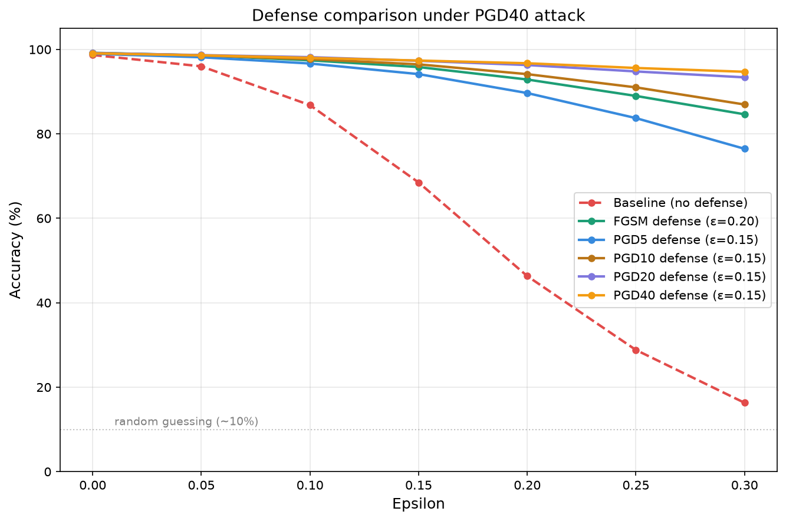

# Adversarial ML — MNIST

Exploring adversarial attacks and defenses on a CNN image classifier trained on MNIST.

## Overview

A CNN is trained on the MNIST handwritten digit dataset and used as a target for adversarial attacks. Two attacks are implemented: FGSM (single-step) and PGD (iterative), and adversarial training is evaluated as a defense. The project explores how well defenses trained against one attack generalise to others, and how defense strength scales with training attack strength.

**Baseline CNN Pipeline**


**Adversarially trained CNN Pipeline**


## Model

### CNN:
- Conv(1 to 32), ReLu, MaxPool(kernel_size=2, stride=2)
- Conv(32 to 64), ReLu, MaxPool(kernel_size=2, stride=2)
- FC(64 * 7 * 7 = 3136 to 128), ReLu
- FC(128 to 10) (final 10 digits 0-9)

### Training:
- Adam
- Learning rate = 0.001
- Epochs = 5
- Batch size = 64

## Results

### FGSM attack on baseline CNN

**Accuracy of baseline model against an FGSM attack**
| Epsilon | Accuracy |
|---------|----------|
| 0.00    | 98.68%   |
| 0.05    | 97.34%   |
| 0.10    | 94.54%   |
| 0.15    | 89.43%   |
| 0.20    | 82.18%   |
| 0.25    | 73.12%   |
| 0.30    | 63.30%   |

Accuracy degrades gradually but not linearly, accelerating above epsilon=0.15. Perturbations appear as grey noise on the background, with digits remain visually recognisable to a human at epsilon=0.30, yet model accuracy drops to 63%. The vulnerability is model-specific, not a perceptual ambiguity.

### PGD attack on baseline CNN (alpha=0.01)

**Accuracy for PGD at different steps and epsilon**
| Epsilon | pgd5   | pgd10  | pgd20  | pgd40  |
|---------|--------|--------|--------|--------|
| 0.00    | 98.68% | 98.68% | 98.68% | 98.68% |
| 0.05    | 97.05% | 96.17% | 96.05% | 95.99% |
| 0.10    | 96.42% | 92.80% | 87.92% | 86.80% |
| 0.15    | 95.99% | 90.72% | 78.29% | 68.48% |
| 0.20    | 95.56% | 89.03% | 70.44% | 46.31% |
| 0.25    | 94.95% | 87.30% | 62.94% | 28.82% |
| 0.30    | 94.65% | 85.51% | 56.80% | 16.30% |

PGD is substantially stronger than FGSM. At epsilon=0.30, pgd40 drops accuracy to 16%, barely above random guessing on a 10-class problem. Attack strength scales with steps but non-linearly, with the gap between 20 and 40 steps is far larger than between 5 and 10.

### FGSM adversarial training defense (trained at epsilon=0.20) vs FGSM attack

**Accuracy of FGSM adversarially trained model at different epsilon**
| Epsilon | Baseline | Defended | Delta   |
|---------|----------|----------|---------|
| 0.00    | 98.68%   | 99.20%   | +0.52%  |
| 0.05    | 97.34%   | 98.91%   | +1.57%  |
| 0.10    | 94.54%   | 98.68%   | +4.14%  |
| 0.15    | 89.43%   | 98.25%   | +8.82%  |
| 0.20    | 82.18%   | 97.93%   | +15.75% |
| 0.25    | 73.12%   | 97.57%   | +24.45% |
| 0.30    | 63.30%   | 97.17%   | +33.87% |

Adversarial training nearly eliminates FGSM vulnerability across all epsilon values, including values not seen during training. In this experiment, adversarial training improved both robustness and clean accuracy, suggesting no robustness-accuracy tradeoff for this model and dataset.

### PGD adversarial training defenses (trained at epsilon=0.15) vs pgd40 attack

**Accuracy of PGD adversarially trained model at different steps and epsilon**
| Epsilon | Baseline | pgd5 def | pgd10 def | pgd20 def | pgd40 def |
|---------|----------|----------|-----------|-----------|-----------|
| 0.00    | 98.68%   | 98.96%   | 99.15%    | 99.13%    | 99.06%    |
| 0.05    | 95.99%   | 98.14%   | 98.59%    | 98.66%    | 98.60%    |
| 0.10    | 86.87%   | 96.66%   | 97.69%    | 98.16%    | 97.99%    |
| 0.15    | 68.34%   | 94.15%   | 96.46%    | 97.30%    | 97.36%    |
| 0.20    | 46.25%   | 89.66%   | 94.14%    | 96.30%    | 96.72%    |
| 0.25    | 28.71%   | 83.73%   | 91.01%    | 94.78%    | 95.60%    |
| 0.30    | 16.29%   | 76.46%   | 86.95%    | 93.38%    | 94.70%    |

Regardless of the number of iterations (steps) taken, any adversarial training using PGD substantially improves the model's accuracy, especially at higher epsilon values (epsilon=0.30).

As MNIST is a simple dataset, we see minimal improvements as the number of iterations is increased. The difference between pgd20 and pgd40 at epsilon=0.30 is only +1.32%, an increase possibly not worth the time and resource required to train the pgd40 trained model.

### Cross-evaluation

How well does each defense generalise to an attack it was not trained against?

**Accuracy of adversarially trained models against other attacks**
| Epsilon | fgsm def / pgd40 atk | pgd40 def / fgsm atk |
|---------|----------------------|----------------------|
| 0.00    | 99.20%               | 99.06%               |
| 0.05    | 98.60%               | 98.75%               |
| 0.10    | 97.41%               | 98.44%               |
| 0.15    | 95.82%               | 97.97%               |
| 0.20    | 92.87%               | 97.58%               |
| 0.25    | 88.98%               | 97.19%               |
| 0.30    | 84.63%               | 96.62%               |

PGD40-trained defense generalises better to FGSM (96.62% at epsilon=0.30) than FGSM-trained defense generalises to PGD40 (84.63%). Training against a stronger, more thorough attack produces more general robustness.

## Visualisations
Each row represents an attack at increasing epsilon, from 0.0 to 0.30.

### Baseline model under FGSM attack


### Baseline model under PGD40 attack


### FGSM-defended model under PGD40 attack


Additional visualisations can be generated for any attack/model combination:
```bash
python -m results.visualize_attacks --attack [fgsm|pgd5|pgd10|pgd20|pgd40] --model [base|fgsm|pgd5|pgd10|pgd20|pgd40]
```
### Defense comparison plot


## Open questions and future extensions

- Are certain digit classes more vulnerable than others to perturbations?
- When misclassifying, does the model confuse specific digit pairs consistently (e.g. 1 and 7)?
- Does model confidence decrease as epsilon increases, or stay high even when wrong?
- Why does adversarial training improve clean accuracy slightly — is this a regularisation effect?
- Would an attack concentrated on digit pixels rather than background be more effective?
- Does the marginal improvement from more PGD training steps justify the training time cost?
- Would these results hold on a harder dataset like CIFAR-10?
- Would curriculum adversarial training (FGSM then PGD) outperform single-attack training, does the order matter, and is the added resources worth it?

## Setup

```bash
git clone https://github.com/EYK02/adversarial-ml.git
cd adversarial-ml
python -m venv venv
venv\Scripts\activate
pip install -r requirements.txt
```

## Reproducing results

Train baseline model:
```bash
python train.py
```

Evaluate attacks on baseline model:
```bash
python -m attacks.evaluate_attack --attack fgsm
python -m attacks.evaluate_attack --attack pgd5
python -m attacks.evaluate_attack --attack pgd10
python -m attacks.evaluate_attack --attack pgd20
python -m attacks.evaluate_attack --attack pgd40
```

Train adversarial defenses:
```bash
python -m defenses.adversarial_training --attack fgsm --epsilon 0.20
python -m defenses.adversarial_training --attack pgd5 --epsilon 0.15
python -m defenses.adversarial_training --attack pgd10 --epsilon 0.15
python -m defenses.adversarial_training --attack pgd20 --epsilon 0.15
python -m defenses.adversarial_training --attack pgd40 --epsilon 0.15
```

Evaluate defenses:
```bash
python -m defenses.evaluate_defense --attack fgsm --defense fgsm
python -m defenses.evaluate_defense --attack pgd40 --defense pgd5
python -m defenses.evaluate_defense --attack pgd40 --defense pgd10
python -m defenses.evaluate_defense --attack pgd40 --defense pgd20
```

Cross-evaluation:
```bash
python -m defenses.evaluate_defense --attack pgd40 --defense fgsm
python -m defenses.evaluate_defense --attack fgsm --defense pgd40
```
