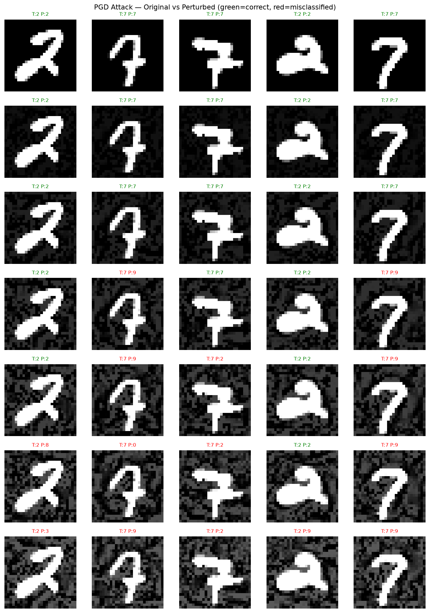
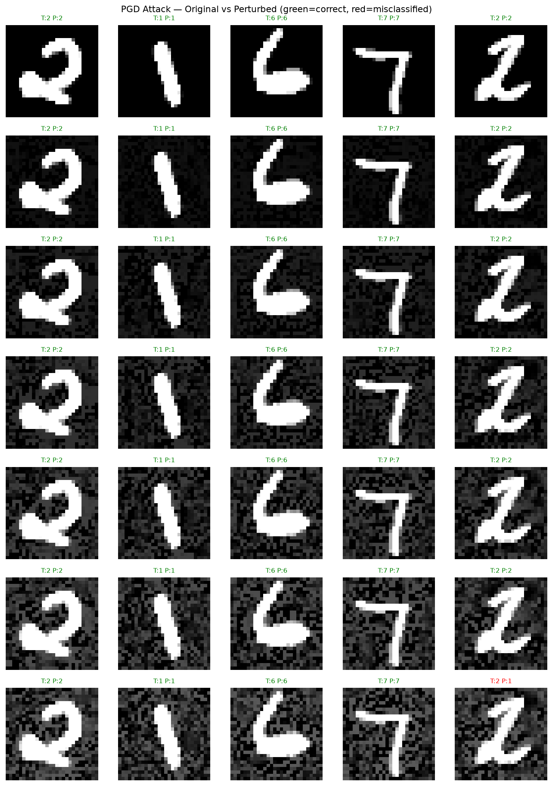

# Adversarial ML - MNIST

Exploring adversarial attacks and defenses on a CNN image classifier trained on MNIST.

## Goal
Train a CNN on MNIST, implement adversarial attacks (FGSM, eventually PGD and more), and evaluate defenses including adversarial training.

## Overview

## Structure
- `attacks/` - attack implementation
- `defenses/` - defense implementation
- `models/` - saved model weights
- `results/` - visualization, plots and metrics

## Results
### FGSM Attack on baseline CNN
|Epsilon|      Test Accuracy|
|------------|--------------|
|0.00|         98.68%|
|0.05|         97.34%|
|0.10|         94.54%|
|0.15|         89.43%|
|0.20|         82.18%|
|0.25|         73.12%|
|0.30|         63.30%|

Accuracy degrades as epsilon increases. Perturberation can be observed as grey noise on the background of the images. The digits remain visually recognizable to a human even at epsilon=0.3, yet the model drops to 63% accuracy.

### Adversarial training defense (trained at epsilon=0.20)
|Epsilon|      Baseline|       Defended|       Delta |    
| ---------| ------------ |---------------|-------------- |
|0.0      |    98.68%|         99.20%      |   +0.52 |
|0.05    |     97.34% |        98.91%     |    +1.57  |    
|0.1    |      94.54%  |       98.68%    |     +4.14   |   
|0.15  |       89.43%   |      98.25%   |      +8.82    |  
|0.2  |        82.18%    |     97.93%  |       +15.75    | 
|0.25|         73.12%     |    97.57% |        +24.45     |
|0.3|          63.30%      |   97.17%|         +33.87|

Adversarial training nearly eliminates FGSM vulnerability accross all epsilon values, including values not seen during training. 

## PGD Attack Evaluation - baseline vs adversarially trained model (trained at epsilon=0.20, evaluated at aplha=0.01 and steps=40)
|Epsilon     |Baseline      |Defended      |Delta     |
|-|-|-|-|
| 0.00       | 98.68       % | 99.20       % | +0.52    |
| 0.05       | 95.99       % | 98.60       % | +2.61    |
| 0.10       | 86.80       % | 97.41       % | +10.61   |
| 0.15       | 68.48       % | 95.82       % | +27.34   |
| 0.20       | 46.31       % | 92.76       % | +46.45   |
| 0.25       | 28.82       % | 88.99       % | +60.17   |
| 0.30       | 16.30       % | 84.42       % | +68.12   |

We can immediately see that PGD is a substantially more stronger attack compared to FGSM. At epsilon=0.30, FGSM gets the baseline down to 63% while PGD gets it down to 16%, not much better than guessing randomly. 

The adversarially trained model still holds up to the PGD attack, going from 99.20% to 84.42% at epsilon=0.30. The defense isn't perfect as compared to FGSM, it drops from 97.17% to 84.42% at epsilon=0.30. Looking at the delta, the defense is clearly doing substantial work, pulling the model from near-random (16%) to being useful (84%).

This shows that adversarial training against FGSM provided partial but still meaningful generalisation to PGD.

## Visualizations
### Baseline model under FGSM attack


### Adversially trained model under FGSM attack


### Baseline model under PGD attack


### Adversially trained model (using FGSM) under PGD attack



## Setup
```bash
git clone https://github.com/EYK02/adversarial-ml.git
cd adversarial-ml
python -m venv venv
venv\Scripts\activate
pip install -r requirements.txt
```

## Reproducing results

Traning baseline model:
```bash
python train.py
```

Evaluate FGSM attack:
```bash
pythin -m attacks.evaluate_fgsm
```

Evaluate PGD attack:
```bash
python -m attacks.evaluate_pgd
```

Visualize attack:
```bash
python -m results.visualize_fgsm
```

Note: To change which model to visualize, one is required to edit the fields model_path and save_path to their relevant paths and relevant variables (alpha and iters for example for PGD).

Train adversarial defense:
```bash
python -m defense.adversarial_training.
```

Evaluate adversarially trained model and compare to baseline model:
```bash
python -m defense.evaluate_defense
```